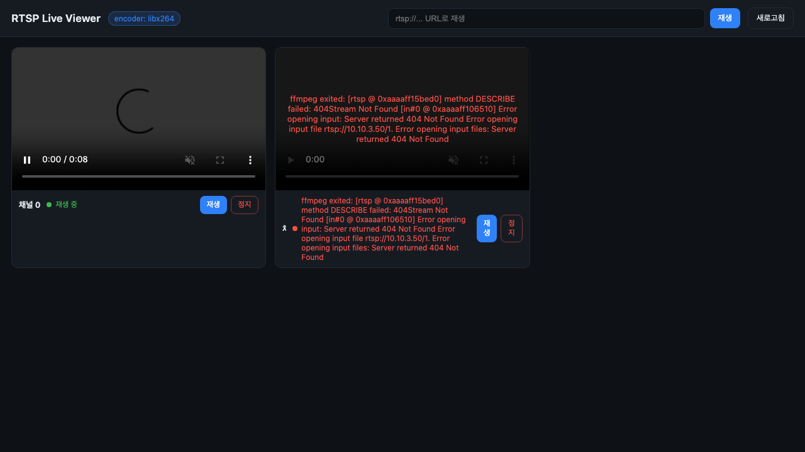
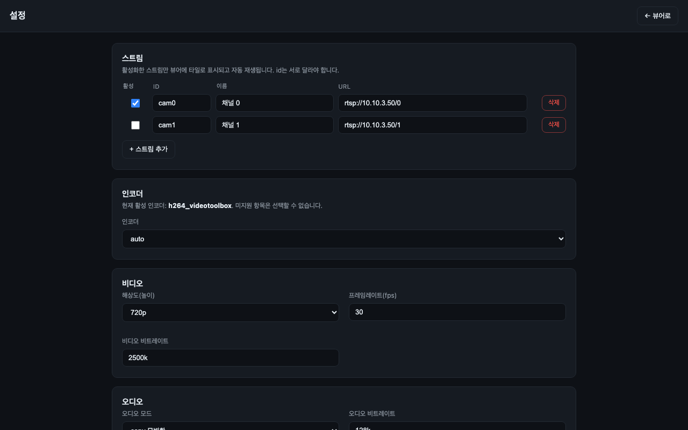

# RTSP Live Viewer

RTSP/RTMP/HTTP 영상 소스를 **ffmpeg로 H.264/HLS로 실시간 변환**해 브라우저에서 **다채널(2~4
동시)** 로 보는 가벼운 뷰어. 백엔드는 Flask, 프론트는 hls.js. Chrome 포함 전체 브라우저 지원.

> 사이니지 장비(SigmaStar) 없이도 장비가 받던 RTSP 소스를 그대로 화면으로 본다.
> (장비의 HDMI 출력 같은 하드웨어 경로는 범위 밖 — 이건 "재생 전용" 도구다.)



## 빠른 시작

### A) 도커 (소프트웨어 인코딩)
```bash
docker compose up -d --build
# http://localhost:8081
```

### B) 네이티브 (모든 HW 인코더 사용 가능 — 권장: Mac/GPU 서버)
```bash
python3 -m venv .venv
.venv/bin/pip install -r requirements.txt
.venv/bin/python server/app.py        # 기본 80포트(권한 필요시 RLV_PORT=8080)
# http://localhost:8080
```

## 설정 (`config.yaml`)
```yaml
encoder: auto            # auto|libx264|h264_videotoolbox|h264_nvenc|h264_qsv
height: 720              # 출력 세로 해상도(0=원본 유지)
fps: 30
video_bitrate: 2500k
hls_time: 2              # HLS 세그먼트 길이(초)
idle_timeout: 30         # 시청 없음 N초 후 해당 ffmpeg 자동 정지(0=비활성)
output_dir: /tmp/rtsp_live
auth: { enabled: false, user: admin, password: admin }
streams:
  - { id: cam0, name: "채널 0", url: "rtsp://10.10.3.50/0" }
  - { id: cam1, name: "채널 1", url: "rtsp://10.10.3.50/1" }
```
- **스트림 추가**: `streams:`에 `{ id, name, url }` 항목을 추가(=화면 타일 1개). `id`는 고유.
- `encoder: auto`는 가용한 HW 인코더(VideoToolbox→NVENC→QSV)를 우선 선택, 없으면 `libx264`.
- 화면의 "URL로 재생" 입력으로 설정에 없는 임시 스트림도 즉석 재생 가능.

> `config.yaml`은 **기본값(시작값)** 역할만 한다. 실제 운영 중 변경은 아래 **설정 페이지**에서
> 하고, 그 결과는 `data/settings.json`에 저장된다(코드 재배포 없이 유지). 즉 `config.yaml`은
> 그대로 두고, 런타임 변경은 settings.json이 덮어쓴다.

## 설정 페이지

웹 UI에서 `config.yaml`을 직접 만지지 않고도 대부분의 항목을 바꿀 수 있다. 뷰어 화면의
**"⚙ 설정"** 버튼 또는 `/settings.html` 경로로 진입한다. 저장하면 `data/settings.json`에
기록되고 다음 트랜스코딩부터 즉시 반영된다(`config.yaml`은 기본값으로 유지).



편집 가능한 항목:

| 그룹 | 항목 | 설명 |
|---|---|---|
| 스트림 | 추가 / 삭제 / 활성화 | 채널을 추가·삭제하거나 활성/비활성으로 **화면에 표시할 개수를 조절** |
| 인코더 | encoder | 환경에서 **가용한 인코더 목록을 자동 감지**해 선택(auto 포함) |
| 비디오 | height / fps / video_bitrate | 출력 해상도·프레임레이트·비트레이트 |
| 오디오 | audio | `aac`(재인코딩) · `copy`(원본 통과) · `none`(무음) |
| 지연·버퍼 | hls_time / hls_list_size | HLS 세그먼트 길이(초) · 재생목록에 유지할 세그먼트 수 |
| 지연·버퍼 | 버퍼(초) | 플레이어 버퍼 = `liveSyncDuration`. 작을수록 지연↓, 끊김 위험↑ |
| 지연·버퍼 | 따라잡기 배속 | 라이브 끝과 벌어졌을 때 살짝 빠르게 재생해 따라잡는 속도 |
| 레이아웃 | 그리드 열 수 | 타일을 몇 열로 배치할지 |
| 자원 | idle_timeout | 시청자 없을 때 N초 후 ffmpeg 자동 정지(유휴 정지) |
| 인증 | auth | HTTP Digest 인증 on/off 및 user/password |

설정 변경은 모두 `data/settings.json`에 저장된다. 도커 사용 시 `./data:/app/data` 볼륨이
마운트되어 컨테이너를 재생성해도 설정이 유지된다(`RLV_DATA_DIR`로 경로 변경 가능).

### 환경변수 override
| 변수 | 용도 |
|---|---|
| `RLV_PORT` | 리슨 포트(기본 80) |
| `RLV_CONFIG` | 설정 파일 경로(기본 프로젝트 루트 `config.yaml`) |
| `RLV_ENCODER` | 인코더 강제 지정 |
| `RLV_DATA_DIR` | 런타임 설정(`settings.json`) 저장 디렉터리(기본 `data/`) |
| `PBOX_FFMPEG` | ffmpeg 바이너리 경로(기본 `ffmpeg`) |

## 인코더 & 성능 / 배포 가이드

**부하의 거의 전부는 ffmpeg 트랜스코딩**이다. Flask/HLS 서빙은 무시할 수준. **시청자 수는 CPU에
거의 무관**(세그먼트를 공유) — 늘어나는 건 대역폭(≈ 시청자수 × 2Mbps).

| 인코딩 방식 | 스트림당 CPU | 비고 |
|---|---|---|
| `libx264` 720p (SW) | ~0.5~1 코어, 거의 실시간 | Chrome 포함 전체 브라우저 |
| `libx264` 1080p (SW) | ~1.5~2 코어 | 해상도 유지 시 |
| HW (`videotoolbox`/`nvenc`/`qsv`) | SW의 **1/5~1/10** | 다채널에 유리 |

RAM ≈ 스트림당 150~300MB.

**권장 사양 (SW H.264 720p 기준)**
| 동시 스트림 | 권장 |
|---|---|
| 1 (소수 시청) | 2~4코어 / 4GB — 소형 PC·VPS·노트북으로 충분 |
| 3~5 | 8코어급 / 8~16GB, 또는 HW 인코더 사용 |
| 다수 | **HW 인코더 서버 필수** |

**서버 vs 로컬 PC 결론**: Chrome 대상 + 다채널이면 **HW 인코더 서버**(또는 상시 미니PC + HW
인코더)가 경제적. 혼자/단일 스트림이면 **로컬 PC로 충분**.

### HW 인코더 주의사항
컨테이너 기본 ffmpeg는 **소프트웨어 인코딩만** 가능하다.
- **Apple VideoToolbox**: 컨테이너 불가 → **Mac 네이티브 실행**(위 B 방법, `encoder: auto` 또는 `h264_videotoolbox`).
- **NVIDIA NVENC**: nvidia-container-toolkit + `gpus: all`(compose 주석 참고), `encoder: h264_nvenc`.
- **Intel QSV**: `/dev/dri` 패스스루(compose 주석 참고), `encoder: h264_qsv`.

## API
| 메서드 | 경로 | 설명 |
|---|---|---|
| GET | `/api/streams` | 스트림 목록 + 상태 + 활성 인코더 |
| GET | `/api/streams/<id>/start` | 트랜스코드 시작 → `{ok, playlist}` |
| GET | `/api/streams/<id>/stop` | 정지 |
| GET | `/api/streams/<id>/status` | 실행 상태 |
| GET | `/api/play?url=<rtsp...>` | 임시 스트림 즉석 재생 |
| GET | `/api/config` | 현재 런타임 설정 조회(설정 페이지에서 사용) |
| POST | `/api/config` | 런타임 설정 저장 → `data/settings.json` |
| GET | `/hls/<id>/index.m3u8` | HLS 재생목록(+ `.ts` 세그먼트) |

## 구조
```
rtsp-live-viewer/
├── server/  app.py · streams.py(다중 ffmpeg 매니저) · encoders.py · config.py
├── web/     index.html(그리드+포커스 플레이어) · css/app.css · js/hls.min.js
├── config.yaml · requirements.txt · Dockerfile · docker-compose.yml
```

## 범위
- **포함**: RTSP/RTMP/HTTP → H.264 HLS 다채널 재생, 인코더 자동/수동 선택, 유휴 자동 정지,
  **웹 설정 페이지(스트림·인코더·비디오·오디오·지연/버퍼·레이아웃·인증)**, 도커/네이티브.
- **비범위**: 녹화/저장, HTTPS, 인증서, 포털/장비 설정 관리.

## 라이선스
MIT License. 자세한 내용은 [`LICENSE`](LICENSE) 파일을 참고하라.
